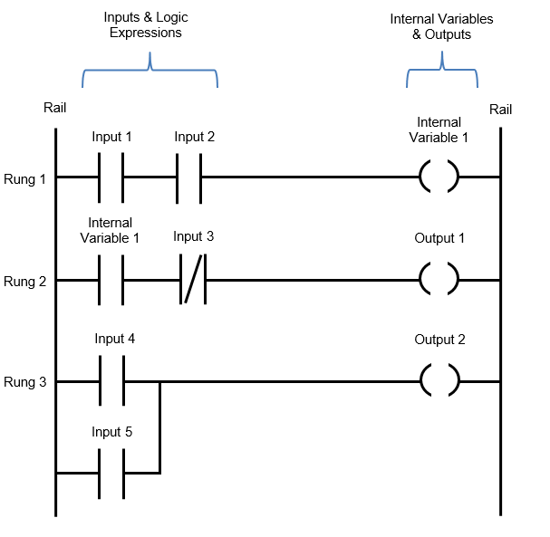

## Ladder Logic

**Ladder Logic** is a graphical programming language widely used to program Programmable Logic Controllers (PLCs) for industrial automation and control systems. Its design and visual structure closely resemble traditional electrical relay circuits, making it intuitive for engineers and technicians familiar with electrical schematics.  

 

### **Key Features and Structure**

- **Visual Representation:** Ladder logic diagrams consist of two vertical rails (representing electrical power lines) and a series of horizontal rungs (representing control logic), visually resembling a ladder.
- **Rule-Based Execution:** Each rung represents a logical rule. The PLC evaluates each rung from left to right and top to bottom in a continuous loop, simulating the flow of electrical current.
- **Core Elements:**
  - **Contacts:** Represent inputs (such as switches or sensors). There are two main types:
    - Normally Open (XIC: Examine If Closed)
    - Normally Closed (XIO: Examine If Open)
  - **Coils:** Represent outputs (such as motors or indicator lights). The most common coil instruction is Output Energize (OTE).
  - **Timers and Counters:** Used for time-based and counting operations, enabling complex sequencing and event tracking.
  - **Math and Comparison Functions:** Allow for calculations and decision-making based on input values and process states.

### **How Ladder Logic Works**

- The PLC scans inputs and updates their status in memory.
- It then executes each rung in sequence, evaluating the logic from left to right.
- If the conditions on a rung are TRUE, the corresponding output action is performed (such as energizing a coil).
- After all rungs are evaluated, outputs are updated, and the cycle repeats rapidly, creating real-time control.
  
### **Why Ladder Logic is Popular**

- **Ease of Learning:** Its similarity to relay logic and electrical schematics makes it accessible for engineers, electricians, and maintenance personnel.
- **Widespread Use:** Ladder logic powers the majority of industrial automation systems, particularly in manufacturing, process control, and machinery automation.
- **Standardization:** Ladder logic is standardized under IEC 61131-3, ensuring consistency across different PLC platforms.

### **Typical Applications**

- Conveyor and material handling systems
- Packaging and labeling lines
- Level and flow control in tanks and hoppers
- Machine safety interlocks and sequencing

### **Basic Example**

A simple rung might check if a start button is pressed (XIC) and a stop button is not pressed (XIO). If both conditions are TRUE, it energizes a motor (OTE).

```plaintext
|----[ ]----[/]----( )----|
|   Start   Stop   Motor  |
|   (XIC)   (XIO)  (OTE)  |
```

**In summary:** Ladder logic remains the cornerstone of PLC programming due to its intuitive, visual approach and its effectiveness in automating complex industrial processes.
## References  
[1] https://www.automationreadypanels.com/plc-hmi/what-is-plc-ladder-logic-and-how-does-it-work/  
[2] https://en.wikipedia.org/wiki/Ladder_logic  
[3] https://ladderlogicworld.com/ladder-logic-basics/  
[4] https://www.spiceworks.com/tech/tech-general/articles/ladder-logic-vs-relay-logic/  
[5] https://www.wevolver.com/article/ladder-logic-programming  
[6] https://www.pubnub.com/learn/glossary/ladder-logic/  
[7] https://www.plctechnician.com/news-blog/basics-ladder-logic  
[8] https://www.sciencedirect.com/topics/engineering/ladder-logic  
---

## Function Block Diagram (FBD)

**Function Block Diagram (FBD)** is a graphical programming language used for designing control logic in Programmable Logic Controllers (PLCs) and other automation systems. It is one of the five standard languages defined by IEC 61131-3, alongside Ladder Logic, Structured Text, Instruction List, and Sequential Function Chart.

---

### Key Features of FBD

- **Graphical Representation:** FBD uses interconnected blocks to represent functions, making the logic easy to visualize and understand.
- **Function Blocks:** Each block performs a specific function, such as logic operations (AND, OR, NOT), mathematical calculations (ADD, SUBTRACT), timers, counters, or more advanced control functions like PID controllers.
- **Connections:** Lines or links connect the inputs and outputs of blocks, showing the flow of data or signals through the system.
- **Modularity:** FBD allows for modular programming, enabling the reuse of custom or standard blocks across different parts of a program.
- **Data Flow:** The directionality of connections (left to right) indicates the flow of information, and the type of data must match at both ends of a connection.

---

### Structure of a Function Block Diagram

- **Inputs:** Variables or signals entering the control system.
- **Function Blocks:** Boxes representing operations or logic, each with defined inputs and outputs.
- **Outputs:** The results or actions produced by the logic, sent to actuators or other devices.
- **Connections:** Lines indicating how data flows from one block to another.

#### Example of Common FBD Symbols

| Symbol       | Description             |
|--------------|------------------------|
| AND Gate     | Logical AND operation  |
| OR Gate      | Logical OR operation   |
| NOT Gate     | Logical NOT operation  |
| ADD Block    | Adds two values        |

---

### Advantages of FBD

- **Intuitive Visualization:** The graphical nature makes it easier to design, understand, and troubleshoot complex logic, especially for engineers familiar with process flow diagrams.
- **Modular and Reusable:** Function blocks can be reused, which simplifies programming and maintenance.
- **Handles Complexity:** Well-suited for continuous processes, mathematical operations, and systems requiring frequent reuse of similar logic.

---

### Disadvantages of FBD

- **Can Become Cluttered:** For very large or poorly organized programs, the diagram can become difficult to read and maintain.
- **Less Widespread:** Not as universally adopted as Ladder Logic, which may make finding resources and support more challenging.
- **Debugging Challenges:** Troubleshooting can be time-consuming if the diagram is not systematically arranged].

---

### Typical Applications

- **Process Control:** Common in industries like chemical processing, water treatment, and power generation, where continuous control is required.
- **Motion and PID Control:** Often used for systems involving motion control and advanced process control (e.g., PID loops).
- **Batch and Sequential Control:** Useful for batch processes where modular, reusable logic is beneficial.

---

### Comparison with Ladder Logic

| Feature             | Ladder Logic            | Function Block Diagram         |
|---------------------|------------------------|-------------------------------|
| Representation      | Relay-based, graphical | Block-based, graphical        |
| Complexity Handling | Limited                | High (suitable for complex)   |
| Modularity          | Less modular           | Highly modular                |
| Industry Adoption   | Very widespread        | Growing, but less common      |


---

### Software Tools for FBD

Popular platforms for creating and editing FBDs include:

- **Codesys**
- **LabVIEW**
- **Simulink**

These tools offer graphical editors, simulation, and code generation features to streamline automation development.

---

**In summary:**  
Function Block Diagram is a powerful, modular, and graphical programming language for PLCs, ideal for complex control systems and continuous processes. Its block-based approach enhances visualization and reusability, making it a preferred choice for many modern automation applications.

## Reference  
[1] https://en.wikipedia.org/wiki/Function_block_diagram  
[2] https://www.plcacademy.com/function-block-diagram-programming/  
[3] https://www.solisplc.com/tutorials/function-block-programming  
[4] https://www.numberanalytics.com/blog/function-block-diagram-essentials-mechatronics  
[5] https://www.plcdepartment.com/blogs/plcblog/plc-programming-languages-a-comparison-of-ladder-logic-function-block-diagrams-and-structured-text  
[6] https://www.edrawsoft.com/article/what-is-functional-block-diagram.html  
[7] https://www.youtube.com/watch?v=2hmBTofwf14  
[8] https://control.com/technical-articles/plc-programming-with-function-block-diagrams/  
[9] https://www.sciencedirect.com/topics/computer-science/function-block-diagram  
[10] https://instrumentationtools.com/plc-functional-block-diagram-for-logic-gates/  
---

## Structured Text (ST) in PLC Programming

**Structured Text (ST)** is a high-level, text-based programming language defined by the IEC 61131-3 standard for programmable logic controllers (PLCs). Unlike graphical languages such as Ladder Logic or Function Block Diagram, Structured Text uses textual code that closely resembles traditional programming languages like Pascal, Python, Java, or C++.

---

### **Key Characteristics**

- **Text-Based:** ST is written as lines of code, not as visual diagrams. This makes it compact and easy to edit, especially for those familiar with software programming.
- **High-Level Syntax:** The language supports complex statements, including loops (`FOR`, `WHILE`, `REPEAT`), conditional logic (`IF-THEN-ELSE`, `CASE`), and function calls (e.g., `SQRT()`, `SIN()`).
- **Familiarity:** Programmers with experience in high-level languages like Python, C, or Java will find ST syntax familiar, making it easier to learn and use for complex control tasks.
- **Standardized:** As part of IEC 61131-3, ST can be used across different PLC brands, increasing portability and flexibility.

---

### **Advantages of Structured Text**

- **No PLC Background Needed:** Programmers with general coding experience can quickly adapt to ST, even without prior PLC knowledge.
- **Efficient for Large Projects:** ST is well-suited for large, complex PLC programs where graphical languages become unwieldy.
- **Easy Editing and Sharing:** Code can be written, edited, and shared as simple text files, making version control and collaboration straightforward.
- **Memory Efficient:** Lacks the overhead of graphical interfaces, making it ideal for systems where processor memory is limited.
- **Combines with Other Languages:** ST can be mixed with other IEC 61131-3 languages within the same PLC project, allowing flexibility.

---

### **Basic Syntax Rules**

- **Statements end with a semicolon** (`;`).
- **Routines close with an `END_IF` or similar statement**.
- **Not case sensitive**, but good practice is to use camelCase for variable names for readability.
- **Comments** start with `(*` and end with `*)`.

#### **Example: Simple Motor Control**

```pascal
IF Start_PB THEN
    Motor_Run_Relay := 1;
END_IF;
```
This code turns on a motor relay if the start pushbutton is pressed.

---

### **When to Use Structured Text**

- For complex mathematical operations, data processing, or algorithms that are cumbersome in graphical languages.
- When deploying or maintaining large-scale, repeatable automation projects.
- In applications where code sharing, portability, and memory efficiency are important.

---

**In summary:**  
Structured Text is a powerful, flexible, and efficient PLC programming language that bridges the gap between traditional software development and industrial automation, making it an increasingly popular choice for modern control systems.
## References  

[1] https://www.realpars.com/blog/structured-text  
[2] https://www.plcacademy.com/structured-text-tutorial/  
[3] https://en.wikipedia.org/wiki/Structured_text  
[4] https://www.youtube.com/watch?v=w4MyoxGnNnk  
[5] https://cdn.automationdirect.com/static/helpfiles/ls_plc/Content/A_IntroductionTopics/LP001-2.htm  
[6] https://www.slideshare.net/slideshow/plc-structured-text-st-programmingpptx/266612470  
[7] https://www.myplctraining.com/blog/learn-structured-text-in-2020  
[8] https://pdhonline.com/courses/e334/e334content.pdf  

---
## Instruction List (IL) in PLC Programming

**Instruction List (IL)** is a low-level, text-based programming language used for programming Programmable Logic Controllers (PLCs). It is one of the original five languages defined by the IEC 61131-3 standard, though it has been deprecated in newer versions of the standard.

---

### **Key Features**

- **Sequential Execution:** IL programs consist of a series of instructions executed one after another by the PLC's logic controller.
- **Assembly-Like Syntax:** The language closely resembles assembly language, using mnemonic codes such as `LD` (Load), `AND`, `OR`, `ST` (Store), `JMP` (Jump), etc.
- **Simple Structure:** Each instruction is typically written on a new line and may include an operator, operand(s), and optional comments].
- **Low-Level Control:** IL provides direct control over program flow with instructions for jumps, subroutine calls, and logical operations.
- **Vendor Variations:** While based on the IEC standard, vendors may have their own mnemonics or additional instructions (e.g., Siemens' "Statement List" or STL).

---

### **Example of Instruction List Code**

```plaintext
LD    Speed
GT    2000
JMPCN VOLTS_OK
LD    Volts
VOLTS_OK LD 1
ST    %Q75
```
This example loads a value, compares it, conditionally jumps, and stores a result.

---

### **Advantages**

- **Efficient and Fast:** IL is memory-efficient and offers fast execution, making it suitable for simple, repetitive tasks.
- **Text-Based Editing:** Easy to edit and manipulate in text editors or spreadsheet software, enabling bulk code generation or address management.
- **Legacy Support:** Still available in many PLC platforms for maintaining older systems.

---

### **Disadvantages**

- **Deprecated:** IL is deprecated in the IEC standard, so it is not recommended for new projects.
- **Less User-Friendly:** Its low-level, assembly-like syntax can be harder to read, write, and troubleshoot compared to graphical languages like Ladder Logic or Function Block Diagram.
- **Limited Adoption:** Modern PLC programming increasingly favors higher-level or graphical languages.

---

### **Typical Instructions**

- `LD` (Load)
- `AND`, `OR`, `NOT` (Logic operations)
- `ST` (Store)
- `JMP`, `JMPCN` (Jump/Conditional Jump)
- `ADD`, `SUB`, `MUL`, `DIV` (Math operations)
- Timers, counters, and comparison instructions

---

### **Summary**

Instruction List is a foundational, low-level PLC programming language that executes a sequence of mnemonic instructions, similar to assembly language. While efficient and still supported for legacy systems, it is being phased out in favor of more modern, user-friendly languages.
## References  
[1] https://instrumentationtools.com/instruction-list-plc-programming/  
[2] https://en.wikipedia.org/wiki/Instruction_list  
[3] https://infosys.beckhoff.com/english.php?content=..%2Fcontent%2F1033%2Ftcplccontrol%2F925244555.html&id=  
[4] https://www.youtube.com/watch?v=m2FQj7Sc7Rw  
[5] https://www.awztech.org/instruction-list-plc-programming.html  
[6] https://dipslab.com/plc-programming-instructions/  
[7] https://www.controleng.com/plc-programming-language-fundamentals-for-improved-operations-maintenance/  
[8] https://inductiveautomation.com/blog/plc-programming-languages-go-beyond-ladder-logic  

---
## Sequential Function Chart (SFC)

**Sequential Function Chart (SFC)** is a graphical programming language defined by the IEC 61131-3 standard for PLC programming. SFC is designed to represent and control sequential and parallel processes, making it ideal for applications that require step-by-step operations, such as manufacturing processes, batch control, and machine sequences.

---

### **Key Features and Structure**

- **Graphical Flow:** SFC programs are visually similar to flowcharts, using boxes and lines to represent the flow of operations
- **Steps (States):** Each step represents a specific state or phase in the process. Steps are drawn as rectangles (single-lined for normal steps, double-lined for the initial step).
- **Transitions:** Steps are connected by transitions, represented by horizontal lines. Each transition has a condition that must be met for the process to move from one step to the next.
- **Actions:** Actions are associated with steps and define what the PLC should do when a particular step is active (e.g., turn on a motor, open a valve).
- **Qualifiers:** Actions can have qualifiers that specify how and when the action is executed (e.g., set, reset, pulse).

---

### **How SFC Works**

1. **Initialization:** The sequence starts at the initial step (init step), which is typically double-lined to distinguish it.
2. **Step Execution:** When a step is active, its associated actions are executed.
3. **Transition Evaluation:** The PLC evaluates the transition condition between steps. If the condition is met, the process moves to the next step, deactivating the previous step and activating the next.
4. **Sequential and Parallel Flows:** SFC can handle both sequential (one step after another) and parallel (multiple steps at the same time) operations, allowing for complex process control.

---

### **Advantages of SFC**

- **Clarity:** Provides a clear, visual representation of process sequences, making it easier to design, understand, and troubleshoot complex logic.
- **Modularity:** Large processes can be broken down into smaller, manageable steps.
- **Versatility:** Can encapsulate and call subroutines written in other IEC 61131-3 languages, such as Ladder Logic, Function Block Diagram, or Structured Text.

---

### **Typical Applications**

- Batch processing (e.g., chemical, food, and beverage)
- Machine operation sequences (e.g., painting, washing, assembly)
- Any process requiring clear step-by-step or state-based control.

---

### **Visual Example**

A simple SFC for a painting process might include:

- **Init Step:** Place part in machine
- **Step 1:** Apply first coat
- **Step 2:** Drying
- **Step 3:** Apply final coat

Transitions between these steps are based on conditions such as timers or sensor inputs.

---

**In summary:**  
Sequential Function Chart is a powerful graphical language for organizing and controlling sequential and parallel operations in PLCs. Its visual, modular approach makes it especially useful for complex, multi-step industrial processes.
## References  
[1] https://control.com/technical-articles/an-overview-of-sequential-function-chart-sfc-programming/  
[2] https://instrumentationtools.com/what-is-sequential-function-chart-sfc/  
[3] https://www.realpars.com/blog/sequential-function-chart  
[4] https://www.sciencedirect.com/topics/computer-science/sequential-function-chart  
[5] https://www.docs.inductiveautomation.com/docs/8.1/ignition-modules/sequential-function-charts  
[6] https://www.youtube.com/watch?v=xCONAyL4Oow  
[7] https://www.automation.siemens.com/sce-static/learning-training-documents/pcs7/v7-0/p01-07-sequential-function-chart-rc1012-en.pdf  
[8] https://sumble.com/tech/sequential-function-charts
